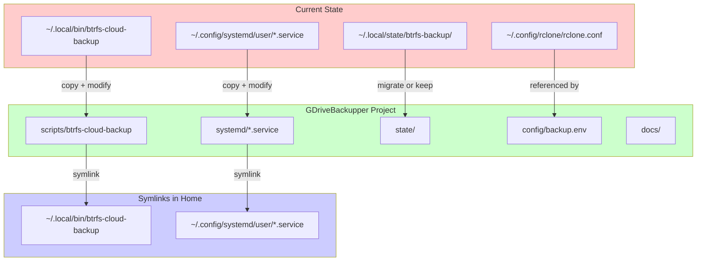

# Migration Plan: Consolidating Backup System to GDriveBackupper Project

## Overview

This document outlines the migration of the CachyOS backup system components from scattered locations in the user's home directory to a centralized, version-controlled project at `/mnt/sandisk_2tb/Projects/GDriveBackupper`.

**Migration Date**: 2026-01-03  
**Author**: Kilo Code Architect Mode

---

## Current State Analysis

### Existing Components Location

| Component | Current Location | Purpose |
|-----------|------------------|--------|
| Backup Script | `~/.local/bin/btrfs-cloud-backup` | Main BTRFS snapshot backup script |
| Backup Service | `~/.config/systemd/user/btrfs-backup.service` | systemd service for backup execution |
| Backup Timer | `~/.config/systemd/user/btrfs-backup.timer` | Daily timer (03:00) |
| GDrive Mount Service | `~/.config/systemd/user/rclone-gdrive.service` | Google Drive FUSE mount |
| State Files | `~/.local/state/btrfs-backup/` | Backup logs and last snapshot tracking |
| rclone Config | `~/.config/rclone/rclone.conf` | rclone remote configuration (K-Solutions) |
| Sudoers Rule | `/etc/sudoers.d/btrfs-backup` | Passwordless sudo for backup script |

### Current Script Dependencies

The `btrfs-cloud-backup` script has the following hardcoded paths:

```bash
REAL_HOME="/home/aaron"
LOCAL_STATE_DIR="$REAL_HOME/.local/state/btrfs-backup"
LOG_FILE="$LOCAL_STATE_DIR/backup.log"
RCLONE_CONFIG="$REAL_HOME/.config/rclone/rclone.conf"
```

---

## Target Project Structure

```
/mnt/sandisk_2tb/Projects/GDriveBackupper/
├── scripts/
│   ├── btrfs-cloud-backup           # Main BTRFS snapshot backup script
│   ├── project-backup               # NEW: Project folder backup script
│   └── install.sh                   # NEW: Installation/setup script
├── systemd/
│   ├── btrfs-backup.service         # Backup service unit
│   ├── btrfs-backup.timer           # Daily backup timer
│   ├── rclone-gdrive.service        # Google Drive mount service
│   ├── project-backup.service       # NEW: Project backup service
│   └── project-backup.timer         # NEW: Project backup timer
├── config/
│   ├── backup.env                   # NEW: Configuration variables
│   ├── exclude-patterns.txt         # NEW: Exclusion patterns for project backups
│   └── rclone.conf.example          # NEW: Example rclone config (no secrets)
├── state/                           # NEW: Centralized state directory
│   └── .gitkeep                     # Placeholder (actual state files gitignored)
├── docs/
│   ├── BACKUP-EVALUATION.md         # Existing: System evaluation
│   ├── BACKUP-SETUP-SUMMARY.md      # Existing: Setup summary
│   ├── cachyos-backup-setup.md      # Existing: Implementation plan
│   ├── MIGRATION-PLAN.md            # This document
│   └── RECOVERY-GUIDE.md            # NEW: Detailed recovery procedures
├── .gitignore                       # NEW: Git ignore rules
├── README.md                        # NEW: Project overview and quick start
└── LICENSE                          # NEW: License file (MIT recommended)
```

---

## Migration Steps

### Phase 1: Prepare Project Structure

#### Step 1.1: Create Directory Structure

```bash
cd /mnt/sandisk_2tb/Projects/GDriveBackupper

# Create directories
mkdir -p scripts systemd config state docs

# Move existing docs
mv BACKUP-EVALUATION.md docs/
mv BACKUP-SETUP-SUMMARY.md docs/
mv cachyos-backup-setup.md docs/
```

#### Step 1.2: Create .gitignore

```bash
cat > .gitignore << 'EOF'
# State files (contain runtime data)
state/*
!state/.gitkeep

# Sensitive configuration
config/rclone.conf
*.secret
*.key

# Logs
*.log
*.log.old

# Temporary files
*.tmp
*.bak
*~

# OS files
.DS_Store
Thumbs.db
EOF
```

#### Step 1.3: Create State Directory Placeholder

```bash
touch state/.gitkeep
```

---

### Phase 2: Migrate Scripts

#### Step 2.1: Copy and Modify Backup Script

Copy the existing script and update paths to be configurable:

```bash
cp ~/.local/bin/btrfs-cloud-backup scripts/btrfs-cloud-backup
chmod +x scripts/btrfs-cloud-backup
```

**Required Modifications to `scripts/btrfs-cloud-backup`:**

1. Add configuration file support at the top of the script:

```bash
#!/bin/bash
# BTRFS Cloud Backup Script
# Uploads daily snapshots to Google Drive

set -euo pipefail

# Project root (where this script lives)
SCRIPT_DIR="$(cd "$(dirname "${BASH_SOURCE[0]}")" && pwd)"
PROJECT_ROOT="$(dirname "$SCRIPT_DIR")"

# Load configuration from environment file if it exists
CONFIG_FILE="${PROJECT_ROOT}/config/backup.env"
if [[ -f "$CONFIG_FILE" ]]; then
    source "$CONFIG_FILE"
fi

# Configuration with defaults (can be overridden by backup.env)
SNAPPER_CONFIG="${SNAPPER_CONFIG:-root}"
RCLONE_REMOTE="${RCLONE_REMOTE:-K-Solutions}"
REMOTE_PATH="${REMOTE_PATH:-Backups/Linux/cachyos-snapshots}"
REAL_USER="${REAL_USER:-aaron}"
REAL_HOME="${REAL_HOME:-/home/aaron}"

# State directory - prefer project state dir, fallback to home
if [[ -d "${PROJECT_ROOT}/state" ]]; then
    LOCAL_STATE_DIR="${PROJECT_ROOT}/state"
else
    LOCAL_STATE_DIR="${REAL_HOME}/.local/state/btrfs-backup"
fi

LOG_FILE="${LOCAL_STATE_DIR}/backup.log"
RCLONE_CONFIG="${RCLONE_CONFIG:-${REAL_HOME}/.config/rclone/rclone.conf}"
MAX_LOG_SIZE="${MAX_LOG_SIZE:-10485760}"  # 10MB
```

2. The rest of the script remains largely unchanged.

#### Step 2.2: Create Configuration File

```bash
cat > config/backup.env << 'EOF'
# BTRFS Cloud Backup Configuration
# This file is sourced by the backup scripts

# Snapper configuration name
SNAPPER_CONFIG="root"

# rclone remote name (as configured in rclone.conf)
RCLONE_REMOTE="K-Solutions"

# Remote path for backups
REMOTE_PATH="Backups/Linux/cachyos-snapshots"

# User configuration (for running as root)
REAL_USER="aaron"
REAL_HOME="/home/aaron"

# rclone configuration file path
RCLONE_CONFIG="/home/aaron/.config/rclone/rclone.conf"

# Maximum log file size before rotation (bytes)
MAX_LOG_SIZE=10485760
EOF
```

#### Step 2.3: Create Example rclone Config

```bash
cat > config/rclone.conf.example << 'EOF'
# Example rclone configuration
# Copy this to ~/.config/rclone/rclone.conf and fill in your credentials

[K-Solutions]
type = drive
scope = drive
# client_id = YOUR_CLIENT_ID
# client_secret = YOUR_CLIENT_SECRET
# token = {"access_token":"...","token_type":"Bearer","refresh_token":"...","expiry":"..."}
# root_folder_id = YOUR_ROOT_FOLDER_ID

# For encrypted backups (recommended), add:
# [K-Solutions-Crypt]
# type = crypt
# remote = K-Solutions:Backups/Linux/encrypted
# password = YOUR_ENCRYPTED_PASSWORD
# password2 = YOUR_ENCRYPTED_SALT
EOF
```

---

### Phase 3: Migrate Systemd Services

#### Step 3.1: Copy Service Files

```bash
cp ~/.config/systemd/user/btrfs-backup.service systemd/
cp ~/.config/systemd/user/btrfs-backup.timer systemd/
cp ~/.config/systemd/user/rclone-gdrive.service systemd/
```

#### Step 3.2: Update Service Paths

**Option A: Symlink Approach (Recommended)**

Keep services pointing to `~/.local/bin/btrfs-cloud-backup` but make that a symlink:

```bash
# Backup original
mv ~/.local/bin/btrfs-cloud-backup ~/.local/bin/btrfs-cloud-backup.original

# Create symlink
ln -s /mnt/sandisk_2tb/Projects/GDriveBackupper/scripts/btrfs-cloud-backup \
      ~/.local/bin/btrfs-cloud-backup
```

This approach requires **no changes** to the systemd service files.

**Option B: Absolute Path Approach**

Modify `systemd/btrfs-backup.service` to use absolute paths:

```ini
[Unit]
Description=BTRFS Snapshot Backup to Google Drive
After=network-online.target rclone-gdrive.service
Wants=network-online.target

[Service]
Type=oneshot
ExecStart=/usr/bin/sudo /mnt/sandisk_2tb/Projects/GDriveBackupper/scripts/btrfs-cloud-backup
Nice=19
IOSchedulingClass=idle
Environment=HOME=/home/aaron
Environment=USER=aaron

[Install]
WantedBy=default.target
```

Then create symlinks for the service files:

```bash
# Remove old service files
rm ~/.config/systemd/user/btrfs-backup.service
rm ~/.config/systemd/user/btrfs-backup.timer

# Create symlinks
ln -s /mnt/sandisk_2tb/Projects/GDriveBackupper/systemd/btrfs-backup.service \
      ~/.config/systemd/user/btrfs-backup.service
ln -s /mnt/sandisk_2tb/Projects/GDriveBackupper/systemd/btrfs-backup.timer \
      ~/.config/systemd/user/btrfs-backup.timer

# Reload systemd
systemctl --user daemon-reload
```

---

### Phase 4: Create Installation Script

Create `scripts/install.sh` for easy setup on new systems:

```bash
#!/bin/bash
# GDriveBackupper Installation Script
# Sets up symlinks and systemd services

set -euo pipefail

SCRIPT_DIR="$(cd "$(dirname "${BASH_SOURCE[0]}")" && pwd)"
PROJECT_ROOT="$(dirname "$SCRIPT_DIR")"

echo "=== GDriveBackupper Installation ==="
echo "Project root: $PROJECT_ROOT"
echo ""

# Check if running as regular user
if [[ $EUID -eq 0 ]]; then
    echo "ERROR: Do not run this script as root"
    echo "Run as your regular user: ./install.sh"
    exit 1
fi

# Create necessary directories
echo "Creating directories..."
mkdir -p ~/.local/bin
mkdir -p ~/.config/systemd/user
mkdir -p ~/.local/state/btrfs-backup

# Backup existing files
backup_if_exists() {
    local file=$1
    if [[ -f "$file" ]] && [[ ! -L "$file" ]]; then
        echo "  Backing up: $file -> ${file}.backup"
        mv "$file" "${file}.backup"
    fi
}

# Create symlinks for scripts
echo "Creating script symlinks..."
backup_if_exists ~/.local/bin/btrfs-cloud-backup
ln -sf "$PROJECT_ROOT/scripts/btrfs-cloud-backup" ~/.local/bin/btrfs-cloud-backup
echo "  ~/.local/bin/btrfs-cloud-backup -> $PROJECT_ROOT/scripts/btrfs-cloud-backup"

# Create symlinks for systemd services
echo "Creating systemd symlinks..."
for service in btrfs-backup.service btrfs-backup.timer rclone-gdrive.service; do
    backup_if_exists ~/.config/systemd/user/$service
    ln -sf "$PROJECT_ROOT/systemd/$service" ~/.config/systemd/user/$service
    echo "  ~/.config/systemd/user/$service -> $PROJECT_ROOT/systemd/$service"
done

# Reload systemd
echo "Reloading systemd..."
systemctl --user daemon-reload

# Enable services
echo "Enabling services..."
systemctl --user enable btrfs-backup.timer
systemctl --user enable rclone-gdrive.service

echo ""
echo "=== Installation Complete ==="
echo ""
echo "Next steps:"
echo "1. Configure rclone if not already done: rclone config"
echo "2. Edit config/backup.env if needed"
echo "3. Start the timer: systemctl --user start btrfs-backup.timer"
echo "4. Start GDrive mount: systemctl --user start rclone-gdrive.service"
echo ""
echo "To verify:"
echo "  systemctl --user status btrfs-backup.timer"
echo "  systemctl --user status rclone-gdrive.service"
```

Make it executable:

```bash
chmod +x scripts/install.sh
```

---

### Phase 5: Create Uninstall Script

Create `scripts/uninstall.sh` for clean removal:

```bash
#!/bin/bash
# GDriveBackupper Uninstallation Script
# Removes symlinks and restores backups

set -euo pipefail

echo "=== GDriveBackupper Uninstallation ==="
echo ""

# Stop services
echo "Stopping services..."
systemctl --user stop btrfs-backup.timer 2>/dev/null || true
systemctl --user disable btrfs-backup.timer 2>/dev/null || true

# Remove symlinks and restore backups
restore_backup() {
    local file=$1
    if [[ -L "$file" ]]; then
        echo "  Removing symlink: $file"
        rm "$file"
        if [[ -f "${file}.backup" ]]; then
            echo "  Restoring backup: ${file}.backup -> $file"
            mv "${file}.backup" "$file"
        fi
    fi
}

echo "Removing script symlinks..."
restore_backup ~/.local/bin/btrfs-cloud-backup

echo "Removing systemd symlinks..."
for service in btrfs-backup.service btrfs-backup.timer rclone-gdrive.service; do
    restore_backup ~/.config/systemd/user/$service
done

# Reload systemd
echo "Reloading systemd..."
systemctl --user daemon-reload

echo ""
echo "=== Uninstallation Complete ==="
echo ""
echo "Note: State files in ~/.local/state/btrfs-backup/ were preserved"
echo "Note: rclone configuration in ~/.config/rclone/ was preserved"
```

---

### Phase 6: Update Sudoers Rule

The existing sudoers rule at `/etc/sudoers.d/btrfs-backup` may need updating if using absolute paths:

**Current rule (likely):**
```
aaron ALL=(ALL) NOPASSWD: /home/aaron/.local/bin/btrfs-cloud-backup
```

**Updated rule (if using symlinks, no change needed):**
The symlink approach means the sudoers rule continues to work.

**Updated rule (if using absolute paths):**
```
aaron ALL=(ALL) NOPASSWD: /mnt/sandisk_2tb/Projects/GDriveBackupper/scripts/btrfs-cloud-backup
```

To update:
```bash
sudo visudo -f /etc/sudoers.d/btrfs-backup
```

---

### Phase 7: Initialize Git Repository

```bash
cd /mnt/sandisk_2tb/Projects/GDriveBackupper

# Initialize git
git init

# Add all files
git add .

# Initial commit
git commit -m "Initial commit: Migrate backup system to centralized project
- Migrated btrfs-cloud-backup script from ~/.local/bin/
- Migrated systemd services from ~/.config/systemd/user/
- Added configuration file support (config/backup.env)
- Added installation/uninstallation scripts
- Consolidated documentation in docs/
- Added .gitignore for sensitive files and state"
```

---

## Migration Workflow Diagram



---

## Backward Compatibility

### What Continues to Work

1. **Existing backups**: All existing backups on Google Drive remain accessible
2. **Systemd timers**: Timer continues to run at 03:00 daily
3. **Manual execution**: `sudo ~/.local/bin/btrfs-cloud-backup` still works (via symlink)
4. **State files**: Backup history and logs are preserved
5. **rclone configuration**: No changes to rclone setup

### What Changes

1. **Script location**: Actual script moves to project directory
2. **Configuration**: Now uses `config/backup.env` for settings
3. **State directory**: Can optionally use project's `state/` directory
4. **Version control**: Scripts and services are now git-tracked

---

## Risk Assessment

### Risk 1: Symlink Breaks During Migration

**Probability**: Low  
**Impact**: High (backups stop working)  
**Mitigation**:
- Keep original files as `.backup` until verified
- Test backup manually after migration
- Monitor timer execution for first few days

**Rollback**:
```bash
# Restore original script
rm ~/.local/bin/btrfs-cloud-backup
mv ~/.local/bin/btrfs-cloud-backup.backup ~/.local/bin/btrfs-cloud-backup

# Restore original services
for f in btrfs-backup.service btrfs-backup.timer rclone-gdrive.service; do
    rm ~/.config/systemd/user/$f
    mv ~/.config/systemd/user/${f}.backup ~/.config/systemd/user/$f
done

systemctl --user daemon-reload
```

### Risk 2: Sudoers Rule Mismatch

**Probability**: Medium (if using absolute paths)  
**Impact**: High (backup fails with permission error)  
**Mitigation**:
- Use symlink approach (no sudoers change needed)
- If using absolute paths, update sudoers before migration

**Rollback**:
```bash
sudo visudo -f /etc/sudoers.d/btrfs-backup
# Restore original path
```

### Risk 3: State File Location Confusion

**Probability**: Low  
**Impact**: Medium (incremental backups may reset to full)  
**Mitigation**:
- Keep state files in original location initially
- Only migrate state after confirming everything works

**Rollback**:
- State files are not deleted, just potentially duplicated

### Risk 4: Project Directory Not Available

**Probability**: Low (SanDisk 2TB is a data drive)  
**Impact**: High (backups fail if drive not mounted)  
**Mitigation**:
- Ensure `/mnt/sandisk_2tb` is mounted at boot
- Add dependency in systemd service
- Consider keeping a fallback copy in home directory

**Rollback**:
- Use uninstall script to restore original setup

---

## Verification Checklist

After migration, verify each component:

### Script Verification

```bash
# Check symlink
ls -la ~/.local/bin/btrfs-cloud-backup
# Should show: btrfs-cloud-backup -> /mnt/sandisk_2tb/Projects/GDriveBackupper/scripts/btrfs-cloud-backup

# Test script execution
sudo ~/.local/bin/btrfs-cloud-backup
# Should complete successfully or show "already backed up"
```

### Systemd Verification

```bash
# Check symlinks
ls -la ~/.config/systemd/user/btrfs-backup.*
ls -la ~/.config/systemd/user/rclone-gdrive.service

# Check timer status
systemctl --user status btrfs-backup.timer
# Should show: active (waiting)

# Check next run time
systemctl --user list-timers btrfs-backup.timer
```

### State File Verification

```bash
# Check state directory
ls -la ~/.local/state/btrfs-backup/
# Should contain: backup.log, last_backup_root

# Check last backup number
cat ~/.local/state/btrfs-backup/last_backup_root
```

### Backup Verification

```bash
# List backups on Google Drive
rclone ls "K-Solutions:Backups/Linux/cachyos-snapshots/" | tail -5

# Check backup size
rclone size "K-Solutions:Backups/Linux/cachyos-snapshots/"
```

---

## Future Enhancements

After successful migration, consider these improvements:

1. **Add project-backup script**: Backup project folders with exclusions
2. **Add encryption**: Implement rclone crypt for secure cloud storage
3. **Add notifications**: Email/push alerts on backup failure
4. **Add verification**: Periodic restore tests
5. **Extend to all disks**: Backup Samsung 250G, Samsung 120G, SanDisk 2TB
6. **Add monitoring dashboard**: Simple status page or script

---

## Summary

This migration plan consolidates the backup system into a single, version-controlled project while maintaining full backward compatibility. The symlink approach ensures existing workflows continue to work while enabling:

- **Version control**: Track changes to scripts and configuration
- **Portability**: Easy setup on new systems via install script
- **Maintainability**: All components in one location
- **Documentation**: Comprehensive docs alongside code

**Recommended approach**: Use the symlink method (Option A) for minimal disruption and easiest rollback.

---

*Document Version: 1.0*  
*Last Updated: 2026-01-03*
